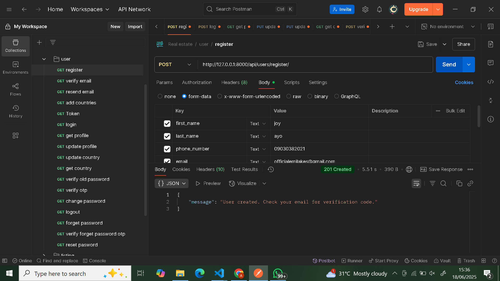

# Real Estate API

A fully-featured Real Estate backend built with Django REST Framework. Supports agent and renter/buyer roles, property listings, inquiries, JWT authentication, and Paystack integration.

---

## Features

-  JWT Authentication with Email Verification
-  Agent & Renter/Buyer Roles
-  Agents can Create, View, Update & Delete Listings
-  Renters/Buyers can Browse Listings
-  Messaging System for Inquiries and Responses
-  Integrated Paystack Payments for Renting/Buying
-  Profile Management with Image Upload
-  Country & Role Selection during Registration
-  Modular Architecture using Django Apps:
  - `users` – registration, login, profile, etc.
  - `listings` – property management
  - `checkout` – cart system
  - `payment` – Paystack integration

---

##  Tech Stack

- **Backend**: Django + Django REST Framework
- **Auth**: JWT (Simple JWT)
- **Payments**: Paystack API
- **Docs**: Swagger (drf-yasg)
- **DB**: SQLite (easily swappable to Postgres/MySQL)

---

## API Documentation

- [Swagger UI](http://localhost:8000/swagger/)
- [ReDoc](http://localhost:8000/redoc/)

---

## Sample Endpoints

| Feature       | Endpoint                        | Method |
|---------------|----------------------------------|--------|
| Register      | `/api/users/register/`           | POST   |
| Login         | `/token/`                        | POST   |
| Listings      | `/api/listings/get/properties/`  | GET    |
| Create Listing| `/api/listings/create/property/` | POST   |
| Make Inquiry  | `/api/listings/enquire/`         | POST   |
| Payment       | `/api/payment/initialize/`       | POST   |


## Screenshots

### Auth & User

- **Register**  
  

- **Verify Email**  
  

- **Resend Email**  
  

- **Login / Token**  
  

- **Get Profile**  
  

- **Update Profile**  
  

- **Change Password Flow**  
    
    
  

### Listings

- **Create Listing**  
  

- **All Listings**  
  

- **Single Listing**  
  

- **Update / Delete / My Listings**  
    
    
  .png)

### Inquiries

- **Make Inquiry**  
  

- **View Inquiries (Renter/Buyer)**  
  .png)

- **View & Reply (Agent)**  
  .png)  
  .png)

### Checkout & Payment

- **Cart**  
  screenshots/add to cart.png 
    
  

- **Payment**  
    
  


## Setup Instructions

```bash
# 1. Clone the repo
git clone https://github.com/Emilakesofficial/real-estate-backend.git
cd real-estate-backend

# 2. Create & activate virtual environment
python -m venv venv
# Windows:
venv\Scripts\activate
# Mac/Linux:
source venv/bin/activate

# 3. Install dependencies
pip install -r requirements.txt

# 4. Apply migrations
python manage.py migrate

# 5. Run server
python manage.py runserver


**Contact**
For inquiries or collaboration:
📧 adegbemiadekunle56@gmail.com
🔗 LinkedIn : https://www.linkedin.com/in/adekunle-adegbemi-4b590a346?utm_source=share&utm_campaign=share_via&utm_content=profile&utm_medium=ios_app